# Presentation de l'algo

Ce document sert de **support de présentation** pour l'architecture définitive du Diamond Solver. Il détaille l'implémentation de la logique métier, les optimisations algorithmiques clés (DFS, Pruning, Caching) et les bonnes pratiques appliquées (Clean Architecture, SOLID, Value Objects).

## 1. Rappel du probleme de base

Le probleme consiste a piloter une usine de robots pendant un nombre fixe de minutes.

- On commence avec 1 robot ore.
- A chaque minute, on peut construire au plus un robot.
- Chaque robot construit produit ensuite une ressource a chaque minute.
- Le but final depend de la version du probleme.

Dans la version originale, la ressource cible est le geode. Dans l'addendum demande ici, une nouvelle ressource est ajoutee: diamond. Le robot diamond consomme des ressources intermediaires et produit des diamonds. Le score d'un blueprint devient alors:

score = blueprint id x nombre maximum de diamonds produits en 24 minutes

Le fichier d'entree d'exemple est [seed.txt](seed.txt), qui contient 2 blueprints avec la regle diamond.

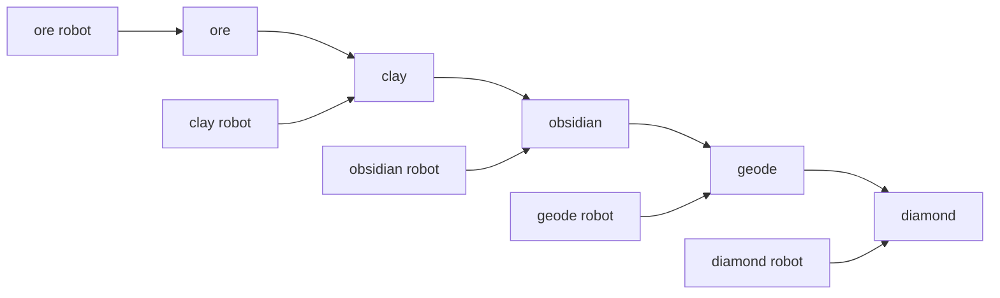

## 2. Vue d'ensemble du code

Le programme est organise en 4 blocs principaux:

1. [Blueprint](src/models/blueprint.py) decrit les couts de fabrication.
2. [State](src/models/state.py) decrit tout l'etat courant de la recherche.
3. [DiamondSolver](src/solver/diamond_solver.py) explore les possibilites.
4. [GameRunner](src/services/runner.py) et [main](src/api/main.py) lancent les calculs et exposent l'API.

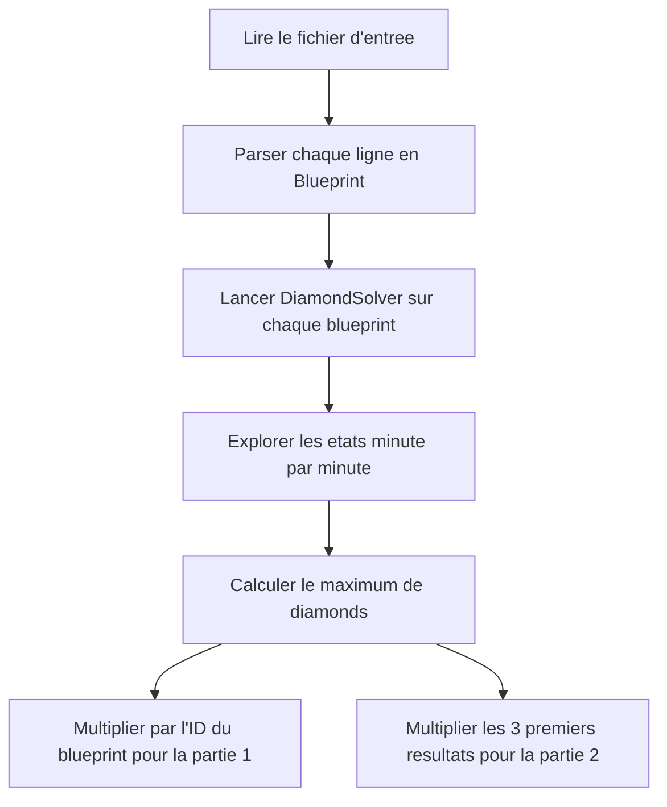

## 3. Le format d'entree

Le parseur est tres simple. Il extrait tous les nombres d'une ligne avec une regex, puis instancie un [Blueprint](src/models/blueprint.py).

```python
@staticmethod
def parse(line: str) -> 'Blueprint':
    numbers = list(map(int, re.findall(r"\d+", line)))
    return Blueprint(*numbers)
```

### Pourquoi ca marche

Chaque ligne de blueprint contient toujours les nombres dans le meme ordre.

Pour l'addendum diamond, une ligne ressemble a ceci:

- id du blueprint
- cout du robot ore
- cout du robot clay
- cout du robot obsidian en ore et clay
- cout du robot geode en ore et obsidian
- cout du robot diamond en geode, clay et obsidian

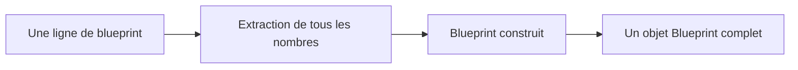

## 4. Le modele de donnees Blueprint et ResourcePack

Le [Blueprint](src/models/blueprint.py) contient les informations de coût de fabrication. Pour éviter l'anti-pattern de *Primitive Obsession* (l'utilisation de variables primitives éparpillées) et les tuples magiques, une structure d'agrégation de type **Value Object** nommée `ResourcePack` (définie dans [resource_pack.py](src/models/resource_pack.py)) est utilisée.

**Explication technique (Value Object & Immutabilité) :**
En tant que *Value Object*, le `ResourcePack` regroupe le stock de ressources, le coût des robots et la capacité de production en une seule entité mathématique immuable. Cela simplifie drastiquement les calculs : au lieu de faire 5 opérations ligne par ligne, on effectue une seule opération mathématique élégante (`resources.subtract(cost).add(robots)`). Son immutabilité lui permet également d'être utilisé comme clé de hachage dans notre système de cache.

```python
class ResourcePack(NamedTuple):
    ore: int = 0
    clay: int = 0
    obsidian: int = 0
    geode: int = 0
    diamond: int = 0
```

Le [Blueprint](src/models/blueprint.py) utilise cette structure en encapsulant chaque coût dans un objet `ResourcePack` :

```python
class Blueprint:
    __slots__ = ("id", "ore_robot_cost", "clay_robot_cost", "obsidian_robot_cost", "geode_robot_cost", "diamond_robot_cost")

    def __init__(
        self,
        id: int,
        ore_robot_ore: int,
        ...
    ):
        self.id = id
        self.ore_robot_cost = ResourcePack(ore=ore_robot_ore)
        self.clay_robot_cost = ResourcePack(ore=clay_robot_ore)
        self.obsidian_robot_cost = ResourcePack(ore=obsidian_robot_ore, clay=obsidian_robot_clay)
        self.geode_robot_cost = ResourcePack(ore=geode_robot_ore, obsidian=geode_robot_obsidian)
        self.diamond_robot_cost = ResourcePack(geode=diamond_robot_geode, clay=diamond_robot_clay, obsidian=diamond_robot_obsidian)
```

> [!NOTE]
> Pour respecter le principe **Open/Closed (OCP)** et garantir la rétrocompatibilité des interfaces, le modèle expose les attributs primitifs (ex: `ore_robot_ore`, `clay_robot_ore`) sous forme de propriétés wrappers.

### Lecture humaine

On peut lire ce modele comme une table de couts:

| Robot | Ressources consommees |
| --- | --- |
| ore | ore |
| clay | ore |
| obsidian | ore + clay |
| geode | ore + obsidian |
| diamond | geode + clay + obsidian |

### Les bornes maximales

Le code calcule les plafonds de dépenses pour optimiser la recherche :

```python
@property
def max_ore_cost(self) -> int:
    return max(
        self.ore_robot_cost.ore,
        self.clay_robot_cost.ore,
        self.obsidian_robot_cost.ore,
        self.geode_robot_cost.ore
    )
```

Le meme principe existe pour clay, obsidian et geode. Ces maxima servent a eviter de construire des robots inutiles en trop grand nombre.

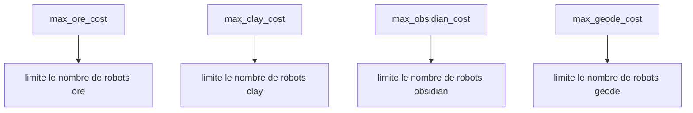

## 5. Le modele d'etat

Le [State](src/models/state.py) représente de manière immuable la situation à un instant précis en regroupant les robots et les ressources dans des objets `ResourcePack`.

```python
class State(NamedTuple):
    time: int
    robots: ResourcePack
    resources: ResourcePack
    skipped: Tuple[bool, bool, bool, bool, bool]
```

### Signification

- `time` = minutes restantes
- `robots` = un `ResourcePack` contenant le nombre de robots actifs pour chaque ressource
- `resources` = un `ResourcePack` contenant les stocks courants et le score de diamants accumulé
- `skipped` = mémoire des choix qu'on a décidé de ne pas faire tout de suite

### L'etat initial

```python
@staticmethod
def initial(max_time: int) -> 'State':
    return State(
        time=max_time,
        robots=ResourcePack(ore=1),
        resources=ResourcePack(),
        skipped=(False, False, False, False, False),
    )
```

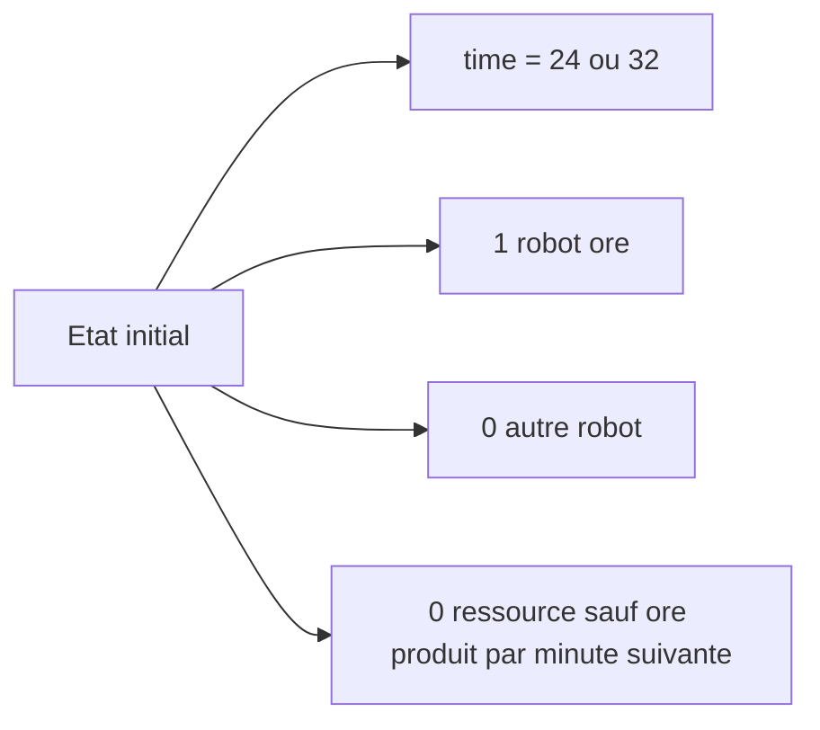

## 6. Comment une minute est simulee

La methode [next_state](src/models/state.py) effectue les transitions d'état en exploitant l'arithmétique propre de `ResourcePack`.

```python
def next_state(
    self,
    robot_diff: ResourcePack,
    cost: ResourcePack,
    skipped_next: Tuple[bool, bool, bool, bool, bool] = (False, False, False, False, False),
) -> 'State':
    return State(
        time=self.time - 1,
        robots=self.robots.add(robot_diff),
        resources=self.resources.subtract(cost).add(self.robots),
        skipped=skipped_next
    )
```

### Lecture pas a pas

1. On consomme le cout du robot choisi.
2. Les robots deja presents produisent leurs ressources.
3. Le nouveau robot est ajoute a la fin de la minute.
4. Les diamonds augmentent grace aux diamond robots deja actifs.

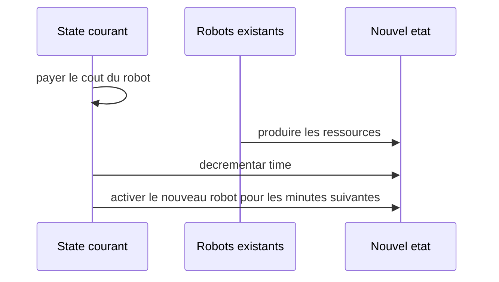

## 7. Le solveur diamonds (moteur de résolution)

Le vrai moteur de recherche est [DiamondSolver](src/solver/diamond_solver.py). Pour respecter le principe **Dependency Inversion (DIP)**, la classe accepte l'injection d'une instance de cache via son constructeur :

```python
class DiamondSolver:
    def __init__(self, blueprint: Blueprint, max_time: int, cache: Optional[StateCache] = None):
        self.blueprint = blueprint
        self.max_time = max_time
        self.cache = cache if cache is not None else StateCache()
        self.max_diamonds = 0
```

### La borne superieure (Évaluation / Pruning)

La méthode de décision pour couper les branches inefficaces (`_is_hopeless`) est gérée de manière centrale par la classe `DiamondSolver` :

```python
def _is_hopeless(self, state: State) -> bool:
    max_possible = (
        state.resources.diamond 
        + state.robots.diamond * state.time 
        + state.time * (state.time - 1) // 2
    )
    return max_possible <= self.max_diamonds
```

Cette formule suppose un cas parfait:

- on garde tous les diamond robots deja construits
- puis on construit un nouveau diamond robot a chaque minute restante
- ce nouveau robot commence a produire plus tard

Si meme ce cas ideal ne bat pas le meilleur score deja vu, la branche est abandonnee.

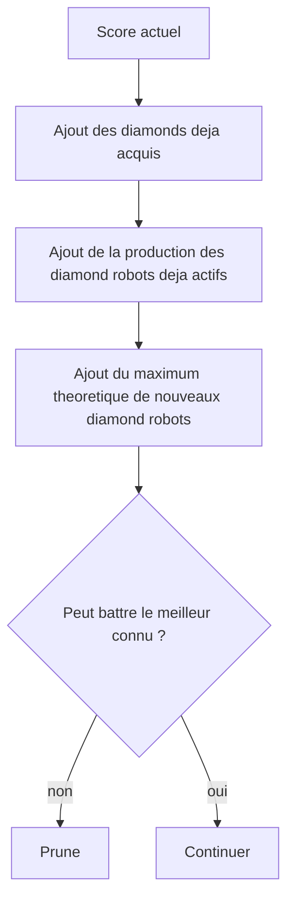

## 8. L'ordre de decision

La methode `_search` du [DiamondSolver](src/solver/diamond_solver.py) suit un ordre très précis :

```python
can_build_diamond = (
    state.resources.geode >= self.blueprint.diamond_robot_cost.geode
    and state.resources.clay >= self.blueprint.diamond_robot_cost.clay
    and state.resources.obsidian >= self.blueprint.diamond_robot_cost.obsidian
)
if can_build_diamond and not state.skipped[0]:
    return self._search(
        state.next_state(
            robot_diff=ResourcePack(diamond=1),
            cost=self.blueprint.diamond_robot_cost
        )
    )
```

### Interpretration

Si un diamond robot est constructible, le solver le construit tout de suite, sauf si on est deja dans une branche qui a volontairement saute cette option.

C'est important parce que le diamond robot produit directement la ressource qu'on cherche a maximiser.

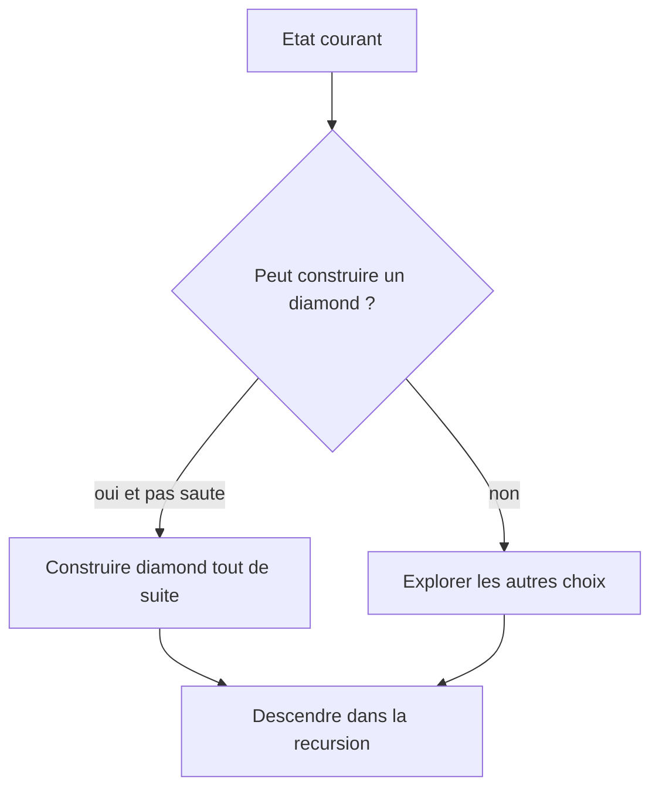

## 9. Les autres choix possibles

Si on ne prend pas diamond immediatement, le solver explore les autres robots:

```python
def _explore_other_choices(self, state: State, can_build_diamond: bool) -> int:
    bp = self.blueprint
    res = state.resources
    rob = state.robots

    can_geode = rob.geode < bp.max_geode_cost and res.ore >= bp.geode_robot_cost.ore and res.obsidian >= bp.geode_robot_cost.obsidian
    can_obsidian = rob.obsidian < bp.max_obsidian_cost and res.ore >= bp.obsidian_robot_cost.ore and res.clay >= bp.obsidian_robot_cost.clay
    can_clay = rob.clay < bp.max_clay_cost and res.ore >= bp.clay_robot_cost.ore
    can_ore = rob.ore < bp.max_ore_cost and res.ore >= bp.ore_robot_cost.ore
```

### Ordre de priorite

1. geode
2. obsidian
3. clay
4. ore
5. ne rien construire

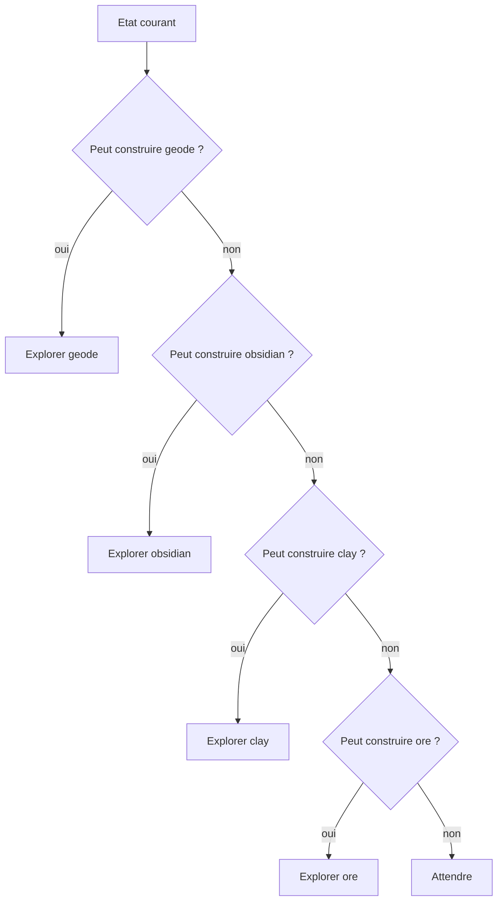

### Le role de skipped

Le tuple `skipped` empeche de revenir immediatement sur un choix qu'on vient de ne pas prendre alors qu'il etait disponible.

```python
none_state = state.next_state(
    robot_diff=ResourcePack(),
    cost=ResourcePack(),
    skipped_next=(can_build_diamond, can_geode, can_obsidian, can_clay, can_ore)
)
```

En pratique:

- si on aurait pu construire diamond mais qu'on a choisi d'attendre
- alors la prochaine branche memorise ce fait
- cela evite de tourner en rond avec les memes decisions

**Explication technique (La logique de "Skip" dans le DFS) :**
C'est une optimisation de *Pruning* cruciale. Si l'algorithme a choisi d'attendre (ne rien construire) à la minute T alors qu'il avait les ressources pour acheter un robot X, il s'interdit d'acheter ce même robot X à la minute T+1. Pourquoi ? Car s'il le voulait vraiment, il aurait dû l'acheter à la minute T pour commencer à produire une minute plus tôt ! La seule justification algorithmique valable pour attendre est de vouloir accumuler des ressources pour un robot plus cher. Le vecteur `skipped` implémente cette mémoire dans l'arbre d'exploration.

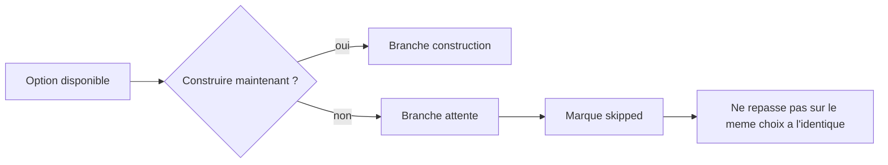

## 10. Le cache de dominance (optimisation 1)

La classe [StateCache](src/solver/cache.py) compare les etats qui ont le meme profil de robots. Pour lever l'ambiguïté des opérations de lecture-écriture et respecter le principe **Command-Query Separation (CQS)**, la méthode `check_and_update_dominance` gère les comparaisons :

```python
state_key = (state.time, state.robots)
```

### Regle de dominance

Si deux etats ont:

- le meme temps restant
- le meme nombre de robots

alors celui qui a le plus de ressources et le plus de diamonds domine l'autre.

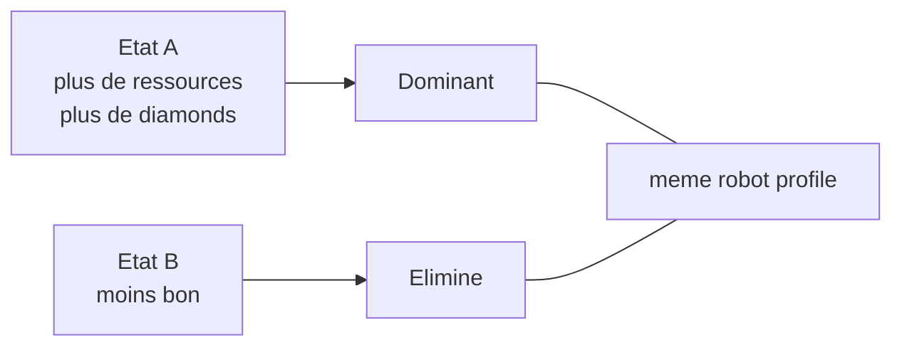

Le cache garde seulement la meilleure version connue pour cette combinaison de robots.

**Explication technique (Caching & Dominance) :**
Plutôt que d'explorer l'intégralité de l'arbre de recherche DFS (qui est de taille exponentielle), on utilise le principe de dominance et de mémorisation. Pour une minute donnée et un ensemble de robots donné, si l'on a déjà trouvé un état par le passé qui possédait des stocks *supérieurs ou égaux* à l'état actuel pour toutes les ressources, on coupe (*prune*) immédiatement cette branche. L'état actuel est considéré "dominé" et ne pourra mathématiquement jamais produire un meilleur résultat final.

## 11. Pourquoi on coupe les stocks inutiles (optimisation 2)

Le solver ne garde pas tous les etats possibles. Il limite les stocks pour la mise en cache. Pour respecter le principe **Single Responsibility (SRP)**, l'algorithme de calcul des stocks maximums est isolé dans la méthode privée `_get_capped_resources` de la classe [DiamondSolver](src/solver/diamond_solver.py) :

```python
def _get_capped_resources(self, state: State) -> ResourcePack:
    def cap(value: int, max_cost: int, robots: int) -> int:
        return min(value, max(0, max_cost * state.time - robots * (state.time - 1)))

    bp = self.blueprint
    return ResourcePack(
        ore=cap(state.resources.ore, bp.max_ore_cost, state.robots.ore),
        clay=cap(state.resources.clay, bp.max_clay_cost, state.robots.clay),
        obsidian=cap(state.resources.obsidian, bp.max_obsidian_cost, state.robots.obsidian),
        geode=cap(state.resources.geode, bp.max_geode_cost, state.robots.geode),
    )
```

### Idee intuitive

Si tu as deja beaucoup plus de ressources qu'il ne sera possible d'en depenser avant la fin, alors garder ce surplus ne change rien.

Exemple:

- si tu peux au maximum depenser 10 ore par minute
- et qu'il reste peu de temps
- alors avoir 500 ore n'apporte pas plus de possibilites que d'en avoir 50

**Explication technique (Resource Capping) :**
L'algorithme limite (plafonne) artificiellement les stocks de ressources représentés dans l'état via la fonction `_get_capped_resources`. Sans ce plafond, le Cache de dominance serait trompé : si un état A a 50 ore et un état B a 500 ore (alors qu'on ne peut mathématiquement en dépenser que 30 avant la fin), le Cache croirait que l'état B est "strictement meilleur" et forcerait l'algorithme à l'explorer. En plafonnant les deux états à 30 ore, le Cache réalise qu'ils sont en réalité équivalents en termes de potentiel. L'état B est donc reconnu comme n'apportant aucune valeur supplémentaire et la branche est immédiatement coupée (*pruned*).

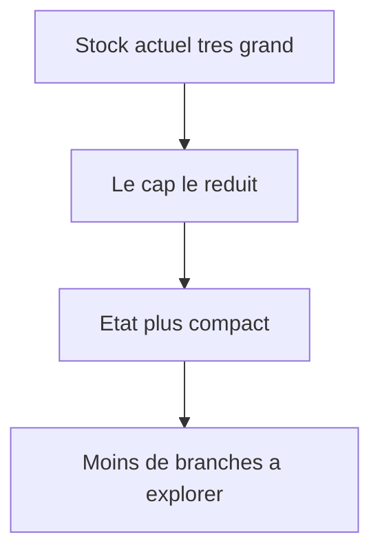

## 12. Comment le score est calcule

La partie 1 n'additionne plus les geodes. Elle multiplie l'ID par le maximum de diamonds pour 24 minutes.

```python
class GameRunner:
    @staticmethod
    def solve_part_one(blueprints: list[Blueprint]) -> int:
        return sum(bp.id * DiamondSolver(bp, 24).solve() for bp in blueprints)
```

### Exemple mental

Si un blueprint d'ID 2 produit 4 diamonds maximum en 24 minutes, sa qualite vaut:

2 x 4 = 8

Pour tous les blueprints, on additionne ces qualites.

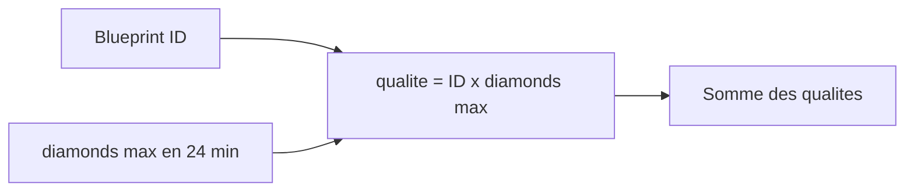

## 13. Partie 2

Le code conserve aussi une partie 2:

```python
@staticmethod
def solve_part_two(blueprints: list[Blueprint]) -> int:
    product = 1
    for bp in blueprints[:3]:
        product *= DiamondSolver(bp, 32).solve()
    return product
```

Cela garde la structure du programme d'origine:

- on ne garde que les 3 premiers blueprints
- on utilise 32 minutes
- on multiplie les resultats

Meme si l'addendum parle surtout de la partie 1, ce bloc reste utile pour conserver un comportement complet du script.

## 14. Le point d'entree du programme

Le programme lit un fichier, parse les blueprints, puis affiche les deux resultats.

```python
def main():
    filepath = sys.argv[1] if len(sys.argv) > 1 else "seed.txt"
    try:
        with open(filepath) as f:
            lines = f.read().strip().splitlines()
        blueprints = [Blueprint.parse(line) for line in lines if line]
        
        print(f"Part 1: {GameRunner.solve_part_one(blueprints)}")
        print(f"Part 2: {GameRunner.solve_part_two(blueprints)}")
    except FileNotFoundError:
        print(f"File {filepath} not found.")
```

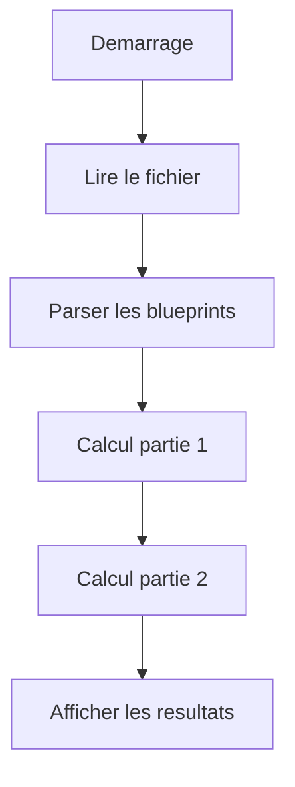

## 15. Ce qu'il faut retenir

Le fonctionnement global est le suivant:

1. Lire les blueprints.
2. Representer l'usine avec un etat complet.
3. Explorer les possibles minute apres minute.
4. Construire en priorite les robots les plus utiles.
5. Couper les branches impossibles ou redondantes.
6. Maximiser les diamonds produits.

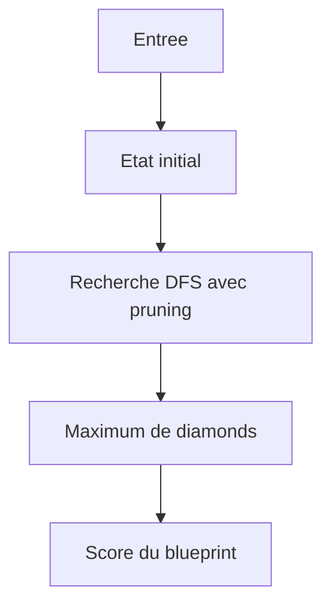

## 16. L'API et l'Interface

L'architecture propose une interface graphique interactive et une API REST avec FastAPI.

### Architecture Modulaire et Clean Code (Services)

Pour se conformer au principe **Single Responsibility (SRP)**, le module de services [analyzer.py](src/services/analyzer.py) est divisé en trois classes distinctes :
1. `FileRepository` : Se charge exclusivement de l'accès au système de fichiers (lecture/écriture).
2. `ReportFormatter` : Gère le rendu et la mise en forme textuelle des rapports.
3. `BlueprintAnalyzer` : Agit en tant que **Facade** orchestrant le processus d'analyse tout en conservant son ancienne signature statique intacte pour ne pas casser l'API REST existante.

### Structure API (`src/api/main.py`)

L'API FastAPI expose deux endpoints principaux:

#### `GET /`
- **Role** : Point d'entree de l'interface legacy (avant NextJS) si le fichier statique est present. Il sert a verifier que le serveur HTTP est bien vivant.
- **Reponse** : Le contenu HTML de l'interface utilisateur ou un statut 404 si manquant.

#### `POST /upload`
- **Role** : Le coeur de l'interaction. Il accepte un fichier `seed.txt` via un formulaire `multipart/form-data`.
- **Processus** : 
  1. Verifie que le fichier termine bien par `.txt`.
  2. Parse le contenu et s'assure que les blueprints sont valides (exactement 10 variables par ligne).
  3. Orchestre l'algorithme via le `GameRunner`.
- **Reponse** : Un JSON structur&eacute; contenant les deux scores calcul&eacute;s :
```json
{
  "part1": 12345,
  "part2": 67890
}
```
En cas d'erreur (fichier corrompu), il retourne un code HTTP 400 (Bad Request) avec le message d'erreur precis (ex: `Error parsing line 1: Expected 10 integers`).

### Interface Graphique (Next.js)

Un frontend en React/Next.js (`frontend/src/app/page.tsx`) accompagne l'application. Il permet a l'utilisateur de deposer en *Drag & Drop* le fichier `seed.txt` et affiche immediatement les scores recuperes par l'API FastAPI.