# Presentation de l'algo

Ce document explique pas a pas le fonctionnement de [submission.py](submission.py), depuis le probleme de base jusqu'a l'extension avec les diamants. L'objectif est que quelqu'un qui decouvre le code puisse comprendre a quoi sert chaque bloc et pourquoi l'algorithme fonctionne.

## 1. Rappel du probleme de base

Le probleme consiste a piloter une usine de robots pendant un nombre fixe de minutes.

- On commence avec 1 robot ore.
- A chaque minute, on peut construire au plus un robot.
- Chaque robot construit produit ensuite une ressource a chaque minute.
- Le but final depend de la version du probleme.

Dans la version originale, la ressource cible est le geode. Dans l'addendum demande ici, une nouvelle ressource est ajoutee: diamond. Le robot diamond consomme des ressources intermediaires et produit des diamonds. Le score d'un blueprint devient alors:

score = blueprint id x nombre maximum de diamonds produits en 24 minutes

Le fichier d'entree d'exemple est [seed.txt](seed.txt), qui contient 2 blueprints avec la regle diamond.

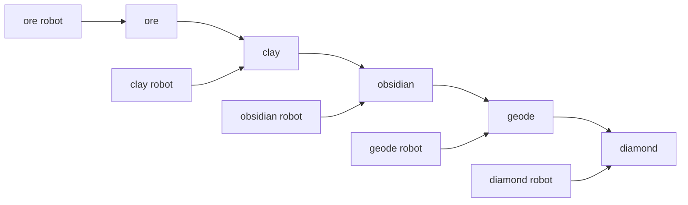

## 2. Vue d'ensemble du code

Le programme est organise en 4 blocs principaux:

1. [Blueprint](submission.py#L8) decrit les couts de fabrication.
2. [State](submission.py#L48) decrit tout l'etat courant de la recherche.
3. [DiamondSolver](submission.py#L154) explore les possibilites.
4. [GameRunner](submission.py#L214) et [main](submission.py#L227) lancent les calculs.

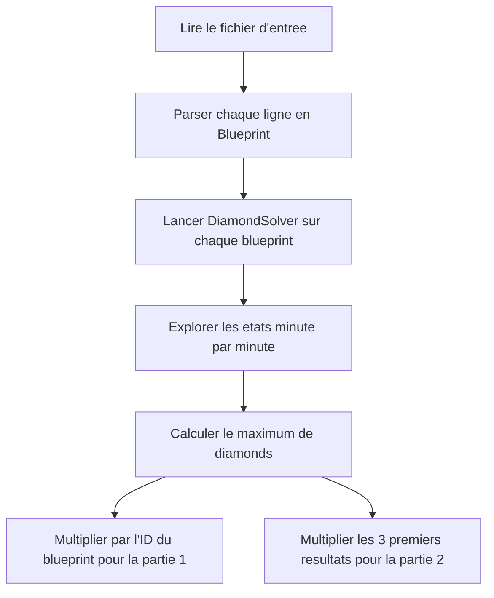

## 3. Le format d'entree

Le parseur est tres simple. Il extrait tous les nombres d'une ligne avec une regex, puis instancie un [Blueprint](submission.py#L8).

```python
@staticmethod
def parse(line: str) -> 'Blueprint':
    numbers = list(map(int, re.findall(r"\d+", line)))
    return Blueprint(*numbers)
```

### Pourquoi ca marche

Chaque ligne de blueprint contient toujours les nombres dans le meme ordre.

Pour l'addendum diamond, une ligne ressemble a ceci:

- id du blueprint
- cout du robot ore
- cout du robot clay
- cout du robot obsidian en ore et clay
- cout du robot geode en ore et obsidian
- cout du robot diamond en geode, clay et obsidian

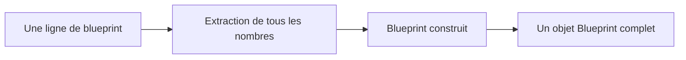

## 4. Le modele de donnees Blueprint

Le [Blueprint](submission.py#L8) contient maintenant 9 couts utiles en plus de l'ID.

```python
@dataclass(frozen=True)
class Blueprint:
    id: int
    ore_robot_ore: int
    clay_robot_ore: int
    obsidian_robot_ore: int
    obsidian_robot_clay: int
    geode_robot_ore: int
    geode_robot_obsidian: int
    diamond_robot_geode: int
    diamond_robot_clay: int
    diamond_robot_obsidian: int
```

### Lecture humaine

On peut lire ce modele comme une table de couts:

| Robot | Ressources consommees |
| --- | --- |
| ore | ore |
| clay | ore |
| obsidian | ore + clay |
| geode | ore + obsidian |
| diamond | geode + clay + obsidian |

### Les bornes maximales

Le code ajoute aussi des proprietes de plafond:

```python
@property
def max_ore_cost(self) -> int:
    return max(
        self.ore_robot_ore,
        self.clay_robot_ore,
        self.obsidian_robot_ore,
        self.geode_robot_ore
    )
```

Le meme principe existe pour clay, obsidian et geode.

Ces maxima servent a eviter de construire des robots inutiles en trop grand nombre.

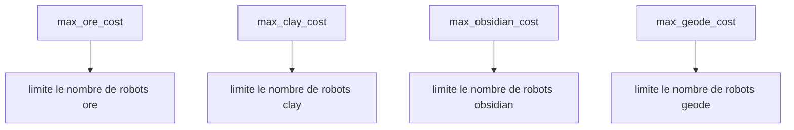

## 5. Le modele d'etat

Le [State](submission.py#L48) contient tout ce qu'il faut pour representer une situation a un instant donne.

```python
@dataclass(frozen=True)
class State:
    time: int
    ore_robots: int
    clay_robots: int
    obsidian_robots: int
    geode_robots: int
    diamond_robots: int
    ore: int
    clay: int
    obsidian: int
    geode: int
    diamonds: int
    skipped: Tuple[bool, bool, bool, bool, bool]
```

### Signification

- `time` = minutes restantes
- `*_robots` = nombre de robots actifs pour chaque ressource
- `ore`, `clay`, `obsidian`, `geode` = stocks courants
- `diamonds` = score accumule, c'est la ressource qu'on veut maximiser
- `skipped` = memoire des choix qu'on a decide de ne pas refaire tout de suite

### L'etat initial

```python
@staticmethod
def initial(max_time: int) -> 'State':
    return State(
        time=max_time,
        ore_robots=1,
        clay_robots=0,
        obsidian_robots=0,
        geode_robots=0,
        diamond_robots=0,
        ore=0,
        clay=0,
        obsidian=0,
        geode=0,
        diamonds=0,
        skipped=(False, False, False, False, False),
    )
```

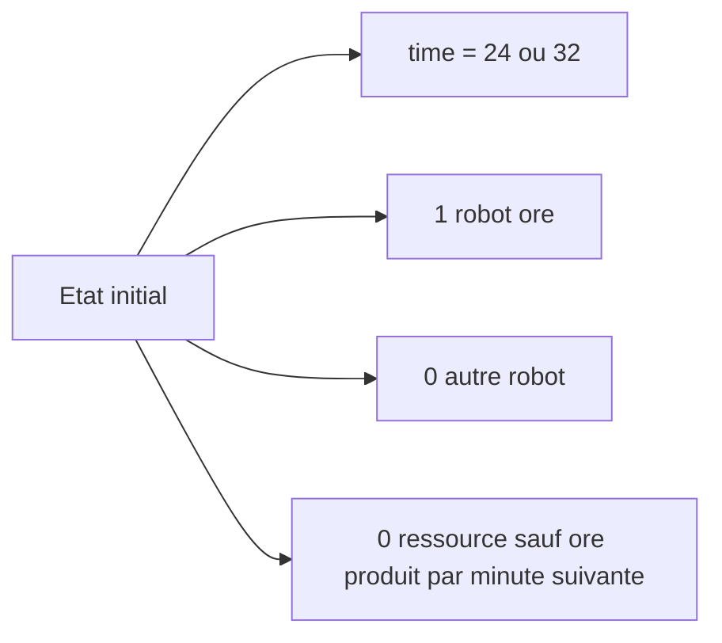

## 6. Comment une minute est simulee

La methode [next_state](submission.py#L79) est le coeur du simulateur.

```python
def next_state(
    self,
    robot_diff: Tuple[int, int, int, int, int],
    cost: Tuple[int, int, int, int],
    skipped_next: Tuple[bool, bool, bool, bool, bool] = (False, False, False, False, False),
) -> 'State':
    c_ore, c_clay, c_obs, c_geode = cost
    return State(
        time=self.time - 1,
        ore_robots=self.ore_robots + robot_diff[0],
        clay_robots=self.clay_robots + robot_diff[1],
        obsidian_robots=self.obsidian_robots + robot_diff[2],
        geode_robots=self.geode_robots + robot_diff[3],
        diamond_robots=self.diamond_robots + robot_diff[4],
        ore=self.ore - c_ore + self.ore_robots,
        clay=self.clay - c_clay + self.clay_robots,
        obsidian=self.obsidian - c_obs + self.obsidian_robots,
        geode=self.geode - c_geode + self.geode_robots,
        diamonds=self.diamonds + self.diamond_robots,
        skipped=skipped_next
    )
```

### Lecture pas a pas

1. On consomme le cout du robot choisi.
2. Les robots deja presents produisent leurs ressources.
3. Le nouveau robot est ajoute a la fin de la minute.
4. Les diamonds augmentent grace aux diamond robots deja actifs.

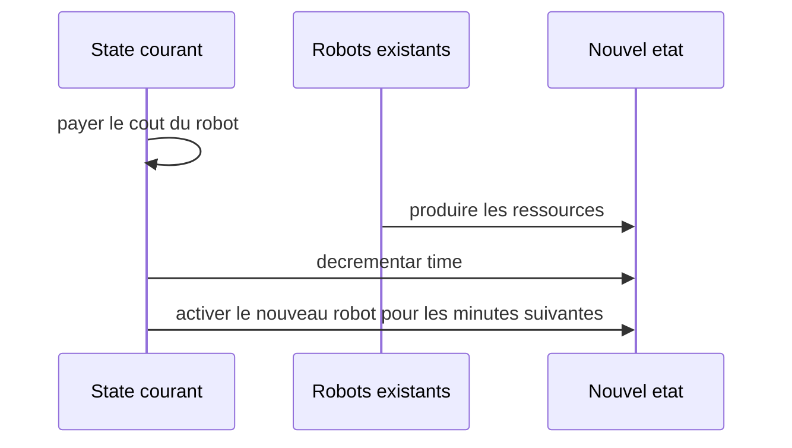

## 7. Pourquoi on coupe les stocks inutiles

Le solver ne garde pas tous les etats possibles. Il limite les stocks qu'il stocke dans le cache grace a [get_capped_resources](submission.py#L101).

```python
def get_capped_resources(self, blueprint: Blueprint) -> Tuple[int, int, int, int]:
    def cap(value: int, max_cost: int, robots: int) -> int:
        return min(value, max(0, max_cost * self.time - robots * (self.time - 1)))
```

### Idee intuitive

Si tu as deja beaucoup plus de ressources qu'il ne sera possible d'en depenser avant la fin, alors garder ce surplus ne change rien.

Exemple:

- si tu peux au maximum depenser 10 ore par minute
- et qu'il reste peu de temps
- alors avoir 500 ore n'apporte pas plus de possibilites que d'en avoir 50

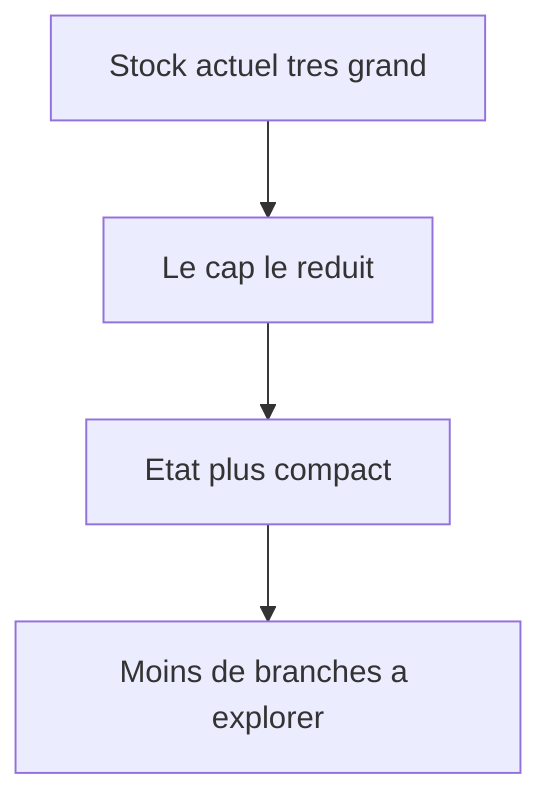

## 8. Le cache de dominance

La classe [StateCache](submission.py#L112) compare les etats qui ont le meme profil de robots.

```python
state_key = (
    state.time,
    state.ore_robots,
    state.clay_robots,
    state.obsidian_robots,
    state.geode_robots,
    state.diamond_robots,
)
```

### Regle de dominance

Si deux etats ont:

- le meme temps restant
- le meme nombre de robots

alors celui qui a le plus de ressources et le plus de diamonds domine l'autre.

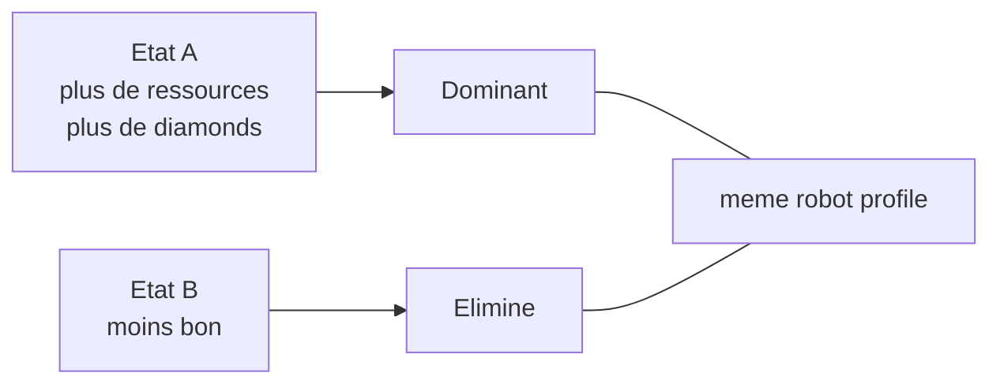

Le cache garde seulement la meilleure version connue pour cette combinaison de robots.

## 9. Le solveur diamonds

Le vrai moteur est [DiamondSolver](submission.py#L154).

```python
class DiamondSolver:
    def __init__(self, blueprint: Blueprint, max_time: int):
        self.blueprint = blueprint
        self.max_time = max_time
        self.cache = StateCache()
        self.max_diamonds = 0
```

### Pourquoi le nom change

Dans la version precedente, on maximisait les geodes.
Ici, on maximise les diamonds.

### La borne superieure

```python
def is_hopeless(self, best_known_diamonds: int) -> bool:
    max_possible = self.diamonds + self.diamond_robots * self.time + self.time * (self.time - 1) // 2
    return max_possible <= best_known_diamonds
```

Cette formule suppose un cas parfait:

- on garde tous les diamond robots deja construits
- puis on construit un nouveau diamond robot a chaque minute restante
- ce nouveau robot commence a produire plus tard

Si meme ce cas ideal ne bat pas le meilleur score deja vu, la branche est abandonnee.

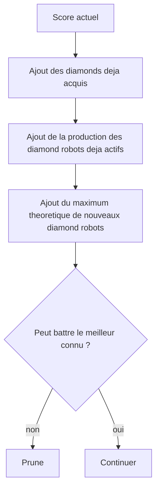

## 10. L'ordre de decision

La methode [_search](submission.py#L164) suit un ordre tres precis.

```python
can_build_diamond = (
    state.geode >= self.blueprint.diamond_robot_geode
    and state.clay >= self.blueprint.diamond_robot_clay
    and state.obsidian >= self.blueprint.diamond_robot_obsidian
)
if can_build_diamond and not state.skipped[0]:
    cost = (0, self.blueprint.diamond_robot_clay, self.blueprint.diamond_robot_obsidian, self.blueprint.diamond_robot_geode)
    return self._search(state.next_state((0, 0, 0, 0, 1), cost))
```

### Interpretration

Si un diamond robot est constructible, le solver le construit tout de suite, sauf si on est deja dans une branche qui a volontairement saute cette option.

C'est important parce que le diamond robot produit directement la ressource qu'on cherche a maximiser.

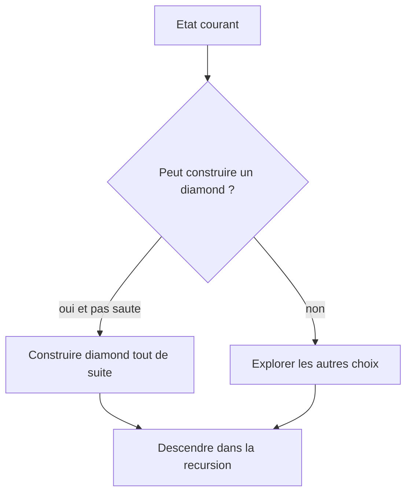

## 11. Les autres choix possibles

Si on ne prend pas diamond immediatement, le solver explore les autres robots:

```python
def _explore_other_choices(self, state: State, can_build_diamond: bool) -> int:
    can_geode = state.geode_robots < self.blueprint.max_geode_cost and state.ore >= self.blueprint.geode_robot_ore and state.obsidian >= self.blueprint.geode_robot_obsidian
    can_obsidian = state.obsidian_robots < self.blueprint.max_obsidian_cost and state.ore >= self.blueprint.obsidian_robot_ore and state.clay >= self.blueprint.obsidian_robot_clay
    can_clay = state.clay_robots < self.blueprint.max_clay_cost and state.ore >= self.blueprint.clay_robot_ore
    can_ore = state.ore_robots < self.blueprint.max_ore_cost and state.ore >= self.blueprint.ore_robot_ore
```

### Ordre de priorite

1. geode
2. obsidian
3. clay
4. ore
5. ne rien construire

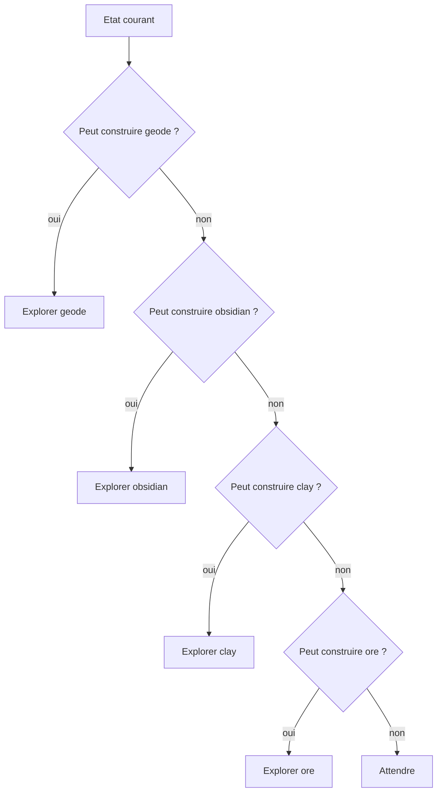

### Le role de skipped

Le tuple `skipped` empeche de revenir immediatement sur un choix qu'on vient de ne pas prendre alors qu'il etait disponible.

```python
none_state = state.next_state(
    (0, 0, 0, 0, 0),
    (0, 0, 0, 0),
    (can_build_diamond, can_geode, can_obsidian, can_clay, can_ore)
)
```

En pratique:

- si on aurait pu construire diamond mais qu'on a choisi d'attendre
- alors la prochaine branche memorise ce fait
- cela evite de tourner en rond avec les memes decisions

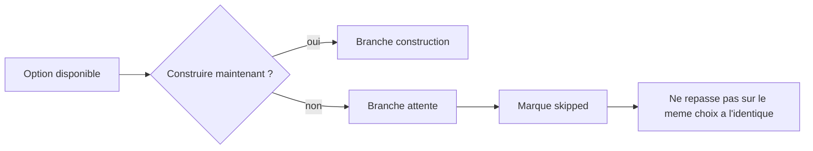

## 12. Comment le score est calcule

La partie 1 n'additionne plus les geodes. Elle multiplie l'ID par le maximum de diamonds pour 24 minutes.

```python
class GameRunner:
    @staticmethod
    def solve_part_one(blueprints: list[Blueprint]) -> int:
        return sum(bp.id * DiamondSolver(bp, 24).solve() for bp in blueprints)
```

### Exemple mental

Si un blueprint d'ID 2 produit 4 diamonds maximum en 24 minutes, sa qualite vaut:

2 x 4 = 8

Pour tous les blueprints, on additionne ces qualites.

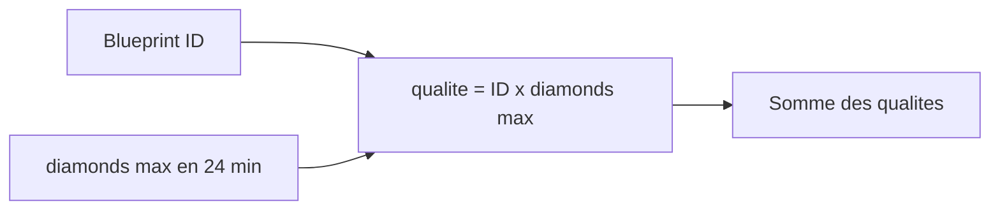

## 13. Partie 2

Le code conserve aussi une partie 2:

```python
@staticmethod
def solve_part_two(blueprints: list[Blueprint]) -> int:
    product = 1
    for bp in blueprints[:3]:
        product *= DiamondSolver(bp, 32).solve()
    return product
```

Cela garde la structure du programme d'origine:

- on ne garde que les 3 premiers blueprints
- on utilise 32 minutes
- on multiplie les resultats

Meme si l'addendum parle surtout de la partie 1, ce bloc reste utile pour conserver un comportement complet du script.

## 14. Le point d'entree du programme

Le programme lit un fichier, parse les blueprints, puis affiche les deux resultats.

```python
def main():
    filepath = sys.argv[1] if len(sys.argv) > 1 else "seed.txt"
    try:
        with open(filepath) as f:
            lines = f.read().strip().splitlines()
        blueprints = [Blueprint.parse(line) for line in lines if line]
        
        print(f"Part 1: {GameRunner.solve_part_one(blueprints)}")
        print(f"Part 2: {GameRunner.solve_part_two(blueprints)}")
    except FileNotFoundError:
        print(f"File {filepath} not found.")
```

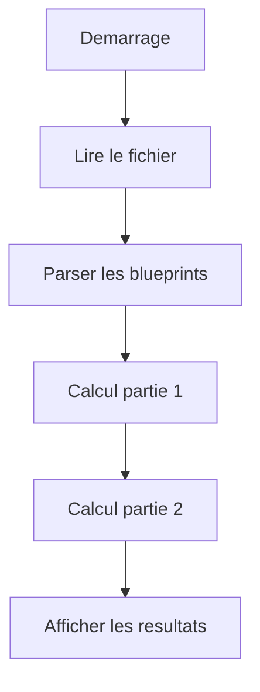

## 15. Ce qu'il faut retenir

Le fonctionnement global est le suivant:

1. Lire les blueprints.
2. Representer l'usine avec un etat complet.
3. Explorer les possibles minute apres minute.
4. Construire en priorite les robots les plus utiles.
5. Couper les branches impossibles ou redondantes.
6. Maximiser les diamonds produits.

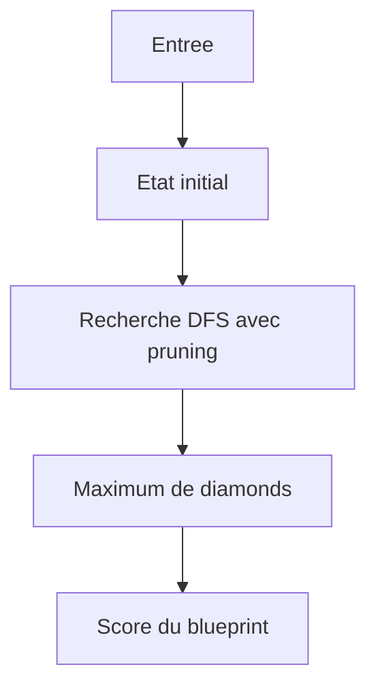